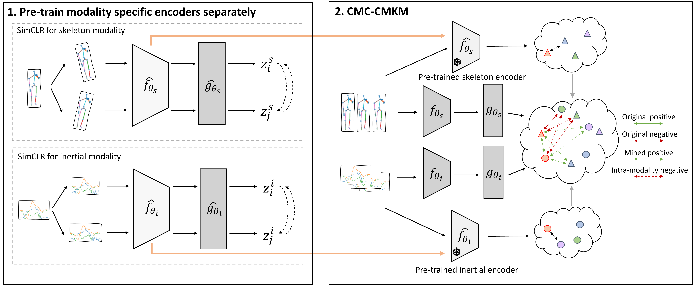

# Self-supervised Multimodal HAR



[to be published in IEEE WCCI 2022 (IJCNN 2022 track)]

Links: [[arXiv]](https://arxiv.org/abs/2205.10071) 

This repository contains work on performing supervised and self-supervised multimodal human activity recognition (HAR) using a variety of different datasets, modalities and approaches.

The framework used across the repository is [Pytorch Lightning](https://www.pytorchlightning.ai/). Logging is performed using [Weights and Biases](https://wandb.ai/).

For consistency in results, the versions that we used are:
* Python: `3.8.11`
* Pytorch: `1.7.1`
* Pytorch Lightning: `1.4.9`
* CUDA: `10.1`

In our reported results, we use 8 CPU workers for data loading and pre-processing, and one NVIDIA Quadro RTX 5000 GPU for model training.

## TL;DR

If you're just looking for an example of the training procedures:
```
# Install Pytorch using your desired environment/method.
...

# Install other requirements.
pip install -r requirements.txt

# Download and unzip data (e.g. UTD-MHAD).
...

# Run a training experiment.
python -m supervised_training --dataset utd_mhad --model transformer --experiment_config_path './configs/inertial_supervised.yaml'
```

To use the other datasets, read the sections below on how to preprocess them into the same format as UTD-MHAD.

# Datasets

The datasets that are currently supported, and their included modalities, are as follows:
* UTD-MHAD [[1](#1)]: inertial, skeleton
* MMAct: [[2](#2)]: inertial, skeleton. Supported evaluation protocols: `cross_subject`, `cross_scene`.

Before you can run the training scripts, you must download the datasets and generate the expected folder structure.

Our intention is for all the supported datasets to be compatible with the provided models. Training a model on a different dataset should only require changing one experiment parameter and, optionally, other model/transform hyperparameters. In order to be able to do this, we provide "raw preprocessing" code which transforms the data for each dataset and saves it into a common, uniform format.

The common format for all data is inspired by the original format of UTD-MHAD: each modality is present in a separate folder, and each sample is one file/subdirectory of that folder.

## Downloading the data

### UTD-MHAD

For UTD-MHAD, either download and extract the data yourself ([link](https://personal.utdallas.edu/~kehtar/UTD-MHAD.html)), or use the provided script:

```
sh datasets/download_utd_mhad.sh YOUR_PATH
```

The script will download and extract the data to `YOUR_PATH/multimodal_har_datasets/utd_mhad`.

### MMAct

For MMAct, you need to request access from the dataset authors ([link](https://mmact19.github.io/2019/)). You need the trimmed sensor and skeleton data (`acc_phone_clip.tar.gz`, `acc_watch_clip.tar.gz`, `gyro_clip.tar.gz`, `orientation_clip.tar.gz`, `trimmed_pose.zip`).

## Raw dataset preprocessing

The scripts required to preprocess the other datasets into UTD-MHAD format are outlined below.

| Dataset | Script path | Notes |
| ---     | ---         | ---   |
| UTD-MHAD | none, data is already in the desired format |    |
| MMAct | `datasets/mmact_raw_preprocessing.py` |  |

For example, assuming you've downloaded the various raw data archives to `YOUR_PATH/multimodal_har_datasets/mmact`, then to process the raw MMAct data you can run:

```
python -m datasets.mmact_raw_preprocessing --data_path YOUR_PATH/multimodal_har_datasets/mmact --destination_path YOUR_PATH/multimodal_har_datasets/mmact_new
```

## Folder structure

The final folder structure could look like:
```
YOUR_PATH/
    multimodal_har_datasets/
        utd_mhad/
            Inertial/
            Skeleton/
        mmact_new/
            Inertial/
            Skeleton/
```

The training scripts require a `--data_path` parameter which must point to the root path of one of the two datasets:
```
--data_path YOUR_PATH/multimodal_har_datasets/utd_mhad
--data_path YOUR_PATH/multimodal_har_datasets/mmact_new
```

## Running unit tests

To validate that the data has been correctly downloaded and processed, you can use the provided unit tests (note that you must update the `DATA_PATH` global variable in each test file to point to the location of the dataset).

```
python -m tests.test_utd_classes
python -m tests.test_utd_data_module
python -m tests.test_mmact_classes
python -m tests.test_mmact_data_module
```

## Info: dataset wrapper classes

The following information is useful if you would like to extend this work by using additional datasets and/or modalities. If you're just looking to train some models, you can skip this part.

Once the desired datasets have been passed through the raw preprocessing scripts and saved in the common format, the provided wrapper classes provide an easy way of using one or multiple modalities from any dataset in your training procedures. The abstract classes `MMHarDataset` and `MMHarDataModule` provide a common interface which allows datasets to be used interchangeably in training.

Each dataset has:
* a LightningDataModule class, which is the "user-facing" wrapper class and can be used with Pytorch Lightning training procedures. This can be instantiated with different modalities, transforms and train/val/test splits.
* (behind the scenes) a dataset manager class, which wraps a Pandas DataFrame which contains information (path, action class, subject, etc.) about each sample in the dataset, for all modalities
* (behind the scenes) dataset instance classes, which contain the code required to load the actual data from the files, for each modality
* (behind the scenes) a Pytorch Dataset class, which uses the manager and instance classes to load data from the disk and provide it in a Pytorch fashion. Each instance is loaded from disk on demand, and currently no data caching is performed.

| Dataset | LightningDataModule source file |
| ---     | ---         |
| UTD-MHAD | `data_modules/utd_mhad_data_module.py` |
| MMAct | `data_modules/mmact_data_module.py` |

# Training

The training procedures that are currently supported are:
* supervised training (unimodal and multimodal) 
* SimCLR (unimodal self-supervised training)
* CMC (multimodal self-supervised training)
* CMC-CMKM (multimodal self-supervised training, as described in our publication)

All training scripts require a path to an experiment configuration file, which contains all of the parameters of the experiment, of the model(s) used in training, and the transformations that will be applied to the data. Check out the `configs` folder for examples for each type of training, for all supported datasets and modalities.

Self-supervised training scripts also require paths to augmentation configuration files, which contain the list of augmentations which can be used for each modality as well as a set of configurable parameters. We provide a standard set of parameters in `configs/inertial_augmentations` and `configs/skeleton_augmentations`.

The models will be automatically instantiated based on the given `class_name` and `from_module` values, and are expected to be located in the `models` folder. The args and kwargs defined in the configuration file will be passed to the LightningModule class.

The transforms will be automatically instantiated and composed based on the given `class_name` and `from_module` values, and are expected to be located in the `transforms` folder. The kwargs defined in the configuration file will be passed to the LightningModule class. All defined transforms will be applied, in order, during training. Only the transforms with `in_test: true` will be applied during validation/testing.

## Backbone models

### Inertial

| Model type | Path | Notes |
| ---  | ---        | ---   |
| transformer | `models/inertial.py` | Transformer-based architecture (from [[3](#3)]) |

### Skeleton

| Model type | Path | Notes |
| ---  | ---        | ---   |
| cooccurrence | `models/skeleton_cooccurrence.py` | Co-occurrence learning using CNNs (implementation based on [[4](#4)]) 

## Supervised training (unimodal and multimodal)

Example 1: inertial unimodal training on UTD-MHAD:

```
python -m supervised_training  \
    --dataset utd_mhad \
    --data_path YOUR_PATH/multimodal_har_datasets/utd_mhad \
    --model transformer \
    --experiment_config_path configs/supervised/inertial_supervised.yaml
```

Example 2: multimodal training on UTD-MHAD from scratch (inertial + skeleton):
```
python -m supervised_training_mm \
    --dataset utd_mhad \
    --data_path YOUR_PATH/multimodal_har_datasets/utd_mhad \
    --modalities inertial skeleton \
    --models transformer cooccurrence \
    --experiment_config_path configs/supervised/mm_inertial_skeleton_supervised_utd.yaml
```

Example 3: multimodal fine-tuning of individually trained supervised encoders on UTD-MHAD (inertial + skeleton):
```
# Train supervised inertial and skeleton encoders separately (see example 1).
python -m supervised_training_mm ...
python -m supervised_training_mm ...

# Train a multimodal encoder.
python -m supervised_training_mm \
    --dataset utd_mhad \
    --data_path YOUR_PATH/multimodal_har_datasets/utd_mhad \
    --modalities inertial skeleton \
    --models transformer cooccurrence \
    --experiment_config_path configs/supervised/mm_inertial_skeleton_supervised_utd.yaml \
    --pre_trained_paths <path_to_transformer_ckpt> <path_to_cooccurrence_ckpt>
```

**Note:** by default, model checkpoints (parameters) are saved in `model_weights/`. The default path for the weights can be changed using the `--model_save_path` argument.

## SimCLR

We provide our own implementation of SimCLR, based on the original paper [[5](#5)], for self-supervised unimodal training.

Example 1: SimCLR using skeleton data on UTD-MHAD:
```
python -m ssl_training \
    --dataset utd_mhad \
    --data_path YOUR_PATH/multimodal_har_datasets/utd_mhad \
    --model cooccurrence \
    --experiment_config_path configs/simclr/skeleton_simclr_utd.yaml \
    --framework simclr \
    --augmentations_path configs/skeleton_augmentations/augmentations_utd.yaml
```

Example 2: SimCLR using inertial data on MMAct, using the cross-scene protocol:
```
python -m ssl_training \
    --dataset mmact \
    --data_path YOUR_PATH/multimodal_har_datasets/mmact \
    --protocol cross_scene \
    --model transformer \
    --experiment_config_path configs/simclr/inertial_simclr_mmact.yaml \
    --framework simclr \
    --augmentations_path configs/inertial_augmentations/augmentations_mmact.yaml
```

## CMC

We provide our own implementation of CMC, based on the original paper [[6](#6)], as a baseline multimodal self-supervised learning technique.

Example 1: CMC on MMAct (inertial + skeleton):
```
python -m ssl_training_mm \
    --dataset mmact \
    --data_path YOUR_PATH/multimodal_har_datasets/mmact \
    --modalities inertial skeleton \
    --models transformer cooccurrence \
    --experiment_config_path configs/cmc/cmc_inertial_skeleton_mmact.yaml \
    --framework cmc \
    --augmentations_path configs/inertial_augmentations/augmentations_mmact.yaml configs/skeleton_augmentations/augmentations_mmact.yaml
```

## CMC-CMKM

We provide an implementation of CMC-CMKM, our proposed self-supervised multimodal framework for Human Activity Recognition.

The CMC-CMKM technique requires a pair of pre-trained encoders (one for each modality). To maintain the self-supervised setting, we use encoders which are pre-trained with SimCLR (see commands for SimCLR above).

To ensure that the models are loaded correctly, you must also provide (through the `--cmkm_pretrained_encoders_config_paths`) the paths to the configuration files which were used during SimCLR training.

Example 1: CMC-CMKM on UTD-MHAD (inertial + skeleton):
```
# Pre-train a pair of encoders separately using SimCLR.
python -m ssl_training \
    --dataset utd_mhad \
    --data_path YOUR_PATH/multimodal_har_datasets/utd_mhad \
    --model cooccurrence \
    --experiment_config_path configs/simclr/skeleton_simclr_utd.yaml \
    --framework simclr \
    --augmentations_path configs/skeleton_augmentations/augmentations_utd.yaml

python -m ssl_training \
    --dataset utd_mhad \
    --data_path YOUR_PATH/multimodal_har_datasets/utd_mhad \
    --model transformer \
    --experiment_config_path configs/simclr/inertial_simclr_utd.yaml \
    --framework simclr \
    --augmentations_path configs/inertial_augmentations/augmentations_utd.yaml

# Train a CMC-CMKM model.
python -m ssl_training_mm \
    --dataset utd_mhad \
    --data_path YOUR_PATH/multimodal_har_datasets/utd_mhad \
    --modalities inertial skeleton \
    --models transformer cooccurrence \
    --experiment_config_path configs/cmc_cmkm/cmc_cmkm_utd.yaml \
    --framework cmc-cmkm \
    --augmentations_path configs/inertial_augmentations/augmentations_utd.yaml configs/skeleton_augmentations/augmentations_utd.yaml \
    --cmkm_pretrained_encoders_config_paths configs/simclr/inertial_simclr_utd.yaml configs/simclr/inertial_simclr_utd.yaml \
    --cmkm_pretrained_encoder_paths <path_to_transformer_simclr_ckpt> <path_to_cooccurrence_simclr_ckpt>
```

Alternatively, we provide in this repository a set of encoders that have been pre-trained with SimCLR and can be used to directly train a CMC-CMKM model.

Example 2: CMC-CMKM with provided pre-trained encoders on MMAct (cross-subject protocol):
```
python -m ssl_training_mm \
    --dataset mmact \
    --data_path YOUR_PATH/multimodal_har_datasets/mmact \
    --modalities inertial skeleton \
    --models transformer cooccurrence \
    --experiment_config_path configs/cmc_cmkm/cmc_cmkm_mmact.yaml \
    --framework cmc-cmkm \
    --augmentations_path configs/inertial_augmentations/augmentations_mmact.yaml configs/skeleton_augmentations/augmentations_mmact.yaml \
    --cmkm_pretrained_encoders_config_paths configs/simclr/inertial_simclr_mmact.yaml configs/simclr/skeleton_simclr_mmact.yaml \
    --cmkm_pretrained_encoder_paths pretrained_encoders/inertial_simclr_mmact_xsubject.ckpt pretrained_encoders/skeleton_simclr_mmact_xsubject.ckpt
```

## Results

In the following table, we compare the performance of the proposed CMC-CMKM approach
to other SSL models, pre-trained in the unimodal setting with SimCLR and in the
multimodal setting with standard CMC. Additionally, we include the performance of
identical encoders trained in a supervised end-to-end manner. The best results are
highlighted in bold, while the second best results are underlined.

All the results in the table below are based on our own implementations, using the 
configuration files provided in this repository.

| Modality   | Approach   | UTD-MHAD (Accuracy) | MMAct cross-subject (F1-score) | MMAct cross-scene (F1-score) |
| --- | --- | --- | --- | --- |
| Inertial | SimCLR     | 72.09% | 52.89% | 59.23% |
| Inertial | Supervised | 76.74% | 61.22% | 78.86% |
| --- | --- | --- | --- | --- |
| Skeleton   | SimCLR     | 95.11%          | 75.82%             | 67.80% |
| Skeleton   | Supervised | 94.65%          | 82.50%             | 70.58% |
| --- | --- | --- | --- | --- |
| Multimodal | CMC        | 96.04%          | 82.05%             | 79.97% |
| **Multimodal** | **CMC-CMKM** | **97.67%** | **84.51%** | <ins>82.91%</ins> |
| Multimodal | Supervised | <ins>97.21%</ins> | <ins>84.05%</ins> | **87.36%** |

## Citation

If you would like to reference our work, please use the following citation:
```
TODO
```

## Acknowledgements

```
TODO
```

## References

<a id="1">[1]</a> C. Chen, R. Jafari, and N. Kehtarnavaz, "UTD-MHAD: A Multimodal Dataset for Human Action Recognition Utilizing a Depth Camera and a Wearable Inertial Sensor", Proceedings of IEEE International Conference on Image Processing, 2015.

<a id="2">[2]</a> Q. Kong, Z. Wu, Z. Deng, M. Klinkigt, B. Tong and T. Murakami, "MMAct: A Large-Scale Dataset for Cross Modal Human Action Understanding", 2019 IEEE/CVF International Conference on Computer Vision (ICCV), 2019.

<a id="3">[3]</a> B. Khaertdinov, E. Ghaleb and S. Asteriadis, "Contrastive Self-supervised Learning for Sensor-based Human Activity Recognition," 2021 IEEE International Joint Conference on Biometrics (IJCB), 2021.

<a id="4">[4]</a> Chao Li, Qiaoyong Zhong, Di Xie, and Shiliang Pu, "Co-occurrence feature learning from skeleton data for action recognition and detection with hierarchical aggregation", Proceedings of the 27th International Joint Conference on Artificial Intelligence (IJCAI'18), 2018.

<a id="5">[5]</a> T. Chen, S. Kornblith, M. Norouzi, and G. Hinton, "A Simple Framework for Contrastive Learning of Visual Representations", Proceedings of the 37th International Conference on Machine Learning, 2020.

<a id="6">[6]</a> Tian, Yonglong, Dilip Krishnan, and Phillip Isola, "Contrastive Multiview Coding", European Conference on Computer Vision, 2020.
